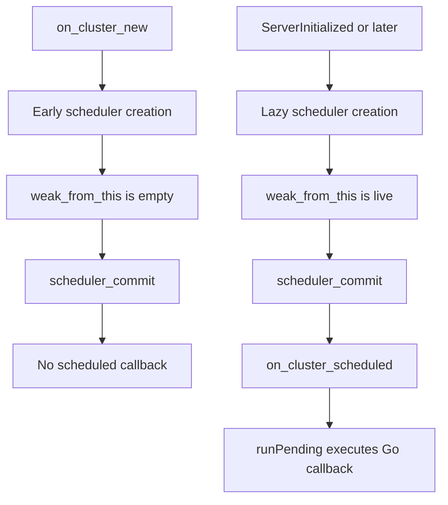

# Envoy ABI Wrapper - transit

Use this skill for work that touches transit's Envoy dynamic module ABI boundary:
`down/down.go`, `down/abi_impl/cluster.go`, `down/abi_impl/lb_policy.go`,
`down/abi_impl/internal.go`, `up/cluster.go`, or `up/lb.go`.

The core job is to keep the public Go API CGO-free while mapping Envoy's C ABI
precisely inside `down/abi_impl`.

## Current layout

```
down/
  down.go             public interfaces, registries, aliases, no CGO
  abi_impl/
    abi.h             vendored Envoy dynamic module C ABI
    internal.go       manager[T], buffer helpers, hostLog
    access_logger.go  mature template for lifecycle + manager patterns
    cluster.go        Cluster Extension ABI implementation
    lb_policy.go      LB Policy ABI implementation
up/
  cluster.go          public Cluster aliases and RegisterCluster
  lb.go               public LB Policy aliases and RegisterLBPolicy
  up.go               HTTP/access-log registration surface
  group.go            user goroutine lifecycle helper
```

Before changing an ABI wrapper, inspect the relevant C declarations in
`down/abi_impl/abi.h` and the existing Go implementation. Envoy ABI signatures
are the source of truth for parameter order, return types, and pointer lifetimes.

## Boundary rules

- `down/down.go` and `up/` must never import `C` or use CGO types.
- Only `down/abi_impl/` touches `C`, `unsafe`, and Envoy ABI typedefs.
- Do not blank-import `github.com/dio/transit/down/abi_impl` from library
  packages such as `up`. The blank import belongs in the `cmd/main.go` that is
  built with `-buildmode=c-shared`.
- Reason: Linux linkers reject ordinary test binaries that contain unresolved
  `envoy_dynamic_module_callback_*` references. Those symbols are provided by
  the running Envoy process only when the module is loaded as a `.so`; macOS may
  allow this accidentally, so Linux CI is the guardrail.
- `down/abi_impl/internal.go` must keep platform linker allowances for package
  tests: Darwin uses `-Wl,-undefined,dynamic_lookup`; Linux uses
  `-Wl,--unresolved-symbols=ignore-all`. Without the Linux flag,
  `go test -race ./...` fails while linking `down/abi_impl.test` even though
  the callbacks are never invoked by unit tests.
- Public APIs use transit types such as `HostPtr`, `HostSpec`,
  `ClusterLBCompletion`, `ClusterHandle`, `ClusterLBHandle`, `LBHandle`,
  `ClusterLBContext`, and `LBContext`.
- `up/cluster.go` and `up/lb.go` should remain thin aliases/re-exports over
  `down` to avoid import cycles.
- Registration functions must panic on duplicate names, matching the existing
  `RegisterAccessLoggerConfigFactory`, `RegisterCluster`, and
  `RegisterLBPolicy` behavior.

## CGO re-entrancy rule

**Never hold a Go mutex when calling any `handle.*` method or Envoy callback.**

Envoy can call back into Go re-entrantly from within a CGO call. For example,
`envoy_dynamic_module_callback_http_send_response` may fire `OnStreamComplete`
before it returns. If Go code holds a mutex during that CGO call, the
re-entrant callback will try to acquire the same mutex and deadlock -- the
goroutine blocks against itself and the request hangs forever with no panic or
error.

The safe pattern: **snapshot all state under the lock, release the lock, then
make all handle/CGO calls with no lock held.**

```go
// WRONG
s.mu.Lock()
defer s.mu.Unlock()
s.handle.SendLocalResponse(...)  // may re-enter; defer never fires

// CORRECT
s.mu.Lock()
snapshot := s.data
s.mu.Unlock()                    // released before any CGO
s.handle.SendLocalResponse(...)  // safe
```

This class of bug is **invisible in unit tests**. Fake handles are pure Go and
never re-enter Go from C. Only a real Envoy binary exposes the deadlock.
Symptom: filter passes all unit tests, hangs forever in e2e with a connected
but never-responding Envoy.

Transit's own `HTTPCallout` path and Go+Do path are structurally designed to
avoid this: the HTTPCallout path is mutex-free (everything on the worker
thread), and the Go+Do path uses `atomic.Bool` instead of a mutex. This rule
applies to **custom code** in ABI wrapper callbacks or user-written async paths
that call handle methods. If you see a custom filter hang in e2e, search for
`defer s.mu.Unlock()` or `s.mu.Lock()` scopes that contain any `handle.*`
call.

## Pointer and memory rules

- Use `manager[T]` for Envoy-to-Go module pointer round trips. Record wrapper
  objects on `*_new`/`*_config_new` and remove them on matching destroy/cancel
  paths.
- Do not hand arbitrary Go pointers to Envoy outside the existing managed
  wrapper pattern.
- Stack-allocate transient handles such as `dymClusterLBHandle`,
  `dymClusterLBContext`, `dymLBHandle`, and `dymLBContext` inside callbacks.
  They are valid only for the current Envoy callback unless the API explicitly
  supports async use.
- Convert Envoy buffers with `envoyBufferToStringUnsafe` when the string must
  survive the callback; it clones today. Use `envoyBufferToUnsafeEnvoyBuffer`
  only for APIs that document callback-scoped lifetime.
- After passing Go strings or byte slices to C with `stringToModuleBuffer` or
  `bytesToModuleBuffer`, call `runtime.KeepAlive` after the C call.

## Cluster Extension lifecycle

Cluster Extension state is split into three managed wrapper levels:

- `clusterConfigWrapper`: per config block, owns `down.ClusterConfigFactory`.
- `clusterWrapper`: per cluster, owns `down.Cluster` and `clusterHandleImpl`.
- `clusterLBWrapper`: per worker LB, owns `down.ClusterLB` and the Envoy LB ptr.

The public API flow is:

1. `up.RegisterCluster(name, down.ClusterFactory)` registers a config parser.
2. `envoy_dynamic_module_on_cluster_config_new` parses config via
   `ClusterFactory.Create`.
3. `envoy_dynamic_module_on_cluster_new` creates `ClusterHandle` and calls
   `ClusterConfigFactory.NewCluster`.
4. Envoy lifecycle exports call `Cluster.Init`, `ServerInitialized`,
   `DrainStarted`, `Shutdown`, and `Close`.
5. `envoy_dynamic_module_on_cluster_lb_new` calls `Cluster.NewClusterLB`.
6. Worker callbacks call `ClusterLB.ChooseHost`, `CancelHostSelection`,
   `OnHostMembershipUpdate`, and `Close`.

Implemented Cluster Extension exports:

```
envoy_dynamic_module_on_cluster_config_new
envoy_dynamic_module_on_cluster_config_destroy
envoy_dynamic_module_on_cluster_new
envoy_dynamic_module_on_cluster_init
envoy_dynamic_module_on_cluster_destroy
envoy_dynamic_module_on_cluster_server_initialized
envoy_dynamic_module_on_cluster_drain_started
envoy_dynamic_module_on_cluster_shutdown
envoy_dynamic_module_on_cluster_scheduled
envoy_dynamic_module_on_cluster_lb_new
envoy_dynamic_module_on_cluster_lb_destroy
envoy_dynamic_module_on_cluster_lb_choose_host
envoy_dynamic_module_on_cluster_lb_cancel_host_selection
envoy_dynamic_module_on_cluster_lb_on_host_membership_update
envoy_dynamic_module_on_cluster_http_callout_done
```

`envoy_dynamic_module_on_cluster_http_callout_done` is currently a required
stub; transit does not expose cluster HTTP callouts.

## Cluster Extension Envoy config

Dynamic module clusters use Envoy's Cluster Extension config, not the LB Policy
extension config. The cluster must use `lb_policy: CLUSTER_PROVIDED`.

```
clusters:
  - name: upstream
    connect_timeout: 5s
    lb_policy: CLUSTER_PROVIDED
    cluster_type:
      name: envoy.clusters.dynamic_modules
      typed_config:
        "@type": type.googleapis.com/envoy.extensions.clusters.dynamic_modules.v3.ClusterConfig
        dynamic_module_config:
          name: <module-name>
        cluster_name: <registered-cluster-name>
        cluster_config:
          "@type": type.googleapis.com/google.protobuf.StringValue
          value: '{"hosts":[{"address":"127.0.0.1:8080"}]}'
```

`cluster_name` must match the name passed to `up.RegisterCluster`. For simple
examples and e2e tests, prefer `google.protobuf.StringValue` carrying JSON so
the module can parse the config without protobuf dependencies.

Do not add TLS, SNI, ALPN, or HTTP protocol knobs to `HostSpec` unless Envoy's
dynamic module ABI requires it. Transit's Cluster Extension host selection owns
which host is selected; Envoy owns upstream transport through cluster config
such as `transport_socket`, `UpstreamTlsContext`, and HTTP protocol options.
Examples may keep endpoint metadata in their own config (`scheme`, `authority`,
`sni`, `protocol`) so integration patching can configure Envoy correctly, but
that metadata should not leak into the low-level ABI wrapper prematurely.

## Cluster main-thread scheduling

`ClusterHandle` methods that mutate cluster state must run on Envoy's main
thread: `AddHosts`, `RemoveHosts`, `UpdateHostHealth`, `PreInitComplete`, and
calls that depend on Envoy cluster main-thread ownership.

From background goroutines or worker callbacks, use `ClusterHandle.Schedule(fn)`.
It stores `fn` in `clusterHandleImpl.pending`, commits through Envoy's cluster
scheduler, then runs `fn` from `envoy_dynamic_module_on_cluster_scheduled`.

Use `up.Group` for user-owned background goroutines. Start it from the user's
cluster lifecycle code and stop it from `Close`/`Shutdown`; do not add generic
goroutine management to `abi_impl`.

### Debugging scheduler failures

When `ClusterHandle.Schedule` appears not to run, debug the ABI boundary before
debugging the example:

1. Add or run a minimal root `e2e/` probe that calls `h.Schedule` from
   `Cluster.ServerInitialized` and exposes simple committed/ran counters through
   an HTTP filter. Keep this separate from feature examples so config parsing,
   DNS, and host mutation do not hide the scheduler signal.
2. Verify the shared library exports the optional callback:

   ```
   nm -g e2e/libe2e.so | rg envoy_dynamic_module_on_cluster_scheduled
   ```

3. Temporarily instrument `down/abi_impl/cluster.go` at scheduler creation,
   `Schedule`, `envoy_dynamic_module_on_cluster_scheduled`, and `runPending`.
   The split is:
   - `Schedule` logs but `on_cluster_scheduled` does not: Envoy did not dispatch
     the posted scheduler event.
   - `on_cluster_scheduled` logs but `runPending` misses: event ID or wrapper
     lookup is wrong.
   - `runPending` runs but the feature fails: debug the user callback, host
     mutation, or snapshot publication.
4. Inspect the Envoy-side implementation for object lifetime assumptions. In
   one scheduler bug, creating the scheduler in `on_cluster_new` was too early:
   Envoy's scheduler captured `cluster->weak_from_this()` before the C++ cluster
   was owned by a `shared_ptr`, so later commits were no-ops. Creating the
   scheduler lazily on first `Schedule` fixed the path.
5. Once fixed, keep the minimal e2e probe as regression coverage, then rerun the
   original example e2e that exposed the problem.



## Async ClusterLB host selection

`ClusterLB.ChooseHost` returns:

- `(host, nil)` for synchronous success.
- `(nil, nil)` for synchronous no-host/failure.
- `(nil, completion)` for async selection.

For async paths:

- Create the completion with `ctx.NewCompletion()` so it captures the Envoy LB
  and request context pointers needed for completion.
- `abi_impl` records an `asyncHandleWrapper` in `clusterAsyncManager`, attaches
  a finish hook with `completion.SetFinishFn`, and returns the managed async
  handle to Envoy.
- `completion.Complete(host, detail)` must call Envoy exactly once.
- `envoy_dynamic_module_on_cluster_lb_cancel_host_selection` calls
  `completion.Cancel()` first; only if that wins should it call user
  `ClusterLB.CancelHostSelection(completion)`.
- Completion cleanup must happen on both Complete and Cancel paths.

Never call Envoy async completion after cancellation or after the finish hook has
removed the async wrapper.

## LB Policy lifecycle

LB Policy is smaller than Cluster Extension:

- `lbConfigWrapper`: per policy config, owns `down.LBPolicyConfigFactory`.
- `lbWrapper`: per worker LB, owns `down.LBPolicy` and the Envoy LB ptr.

The public API flow is:

1. `up.RegisterLBPolicy(name, down.LBPolicyFactory)` registers a config parser.
2. `envoy_dynamic_module_on_lb_config_new` parses config via
   `LBPolicyFactory.Create`.
3. `envoy_dynamic_module_on_lb_new` calls `LBPolicyConfigFactory.NewLBPolicy`.
4. Worker callbacks call `LBPolicy.ChooseHost`, `OnHostMembershipUpdate`, and
   `Close`.

Implemented LB Policy exports:

```
envoy_dynamic_module_on_lb_config_new
envoy_dynamic_module_on_lb_config_destroy
envoy_dynamic_module_on_lb_new
envoy_dynamic_module_on_lb_destroy
envoy_dynamic_module_on_lb_choose_host
envoy_dynamic_module_on_lb_on_host_membership_update
```

LB Policy `ChooseHost` writes priority/index and returns `true`; returning
`false` means no host. It does not support async host selection. `LBContext`
does not expose filter state or downstream SNI; use Cluster Extension for that.

## Handle callback coverage

Cluster and LB handles intentionally share many concepts: priority count, total
hosts, healthy/degraded hosts, address lookup, weights, health, host stats,
metadata, locality, per-host opaque data, and membership update addresses.

When adding a handle method:

1. Add the public method to `down/down.go`.
2. Implement it for both `dymClusterLBHandle` and `dymLBHandle` if Envoy exposes
   equivalent callbacks for both extension types.
3. Add the alias/re-export in `up/cluster.go` or `up/lb.go` only if users need a
   new named type or constant.
4. Preserve callback-scoped lifetime in method comments when returning Envoy
   data directly.

When adding a context method, check whether both ABI contexts support it.
Cluster LB has filter state and downstream SNI; LB Policy currently does not.

## Validation

Run focused tests after wrapper changes:

```
go test ./down/abi_impl ./down ./up
```

For broader API or lifecycle changes, run the repository's normal test target:

```
go test -race ./...
```

Use `transit-unit-testing` when changing unit tests or debugging ordinary
`go test` linker failures around `down/abi_impl`.

If `abi.h` changed via `make update-sdk`, inspect the relevant declarations with
`rg` and re-check every affected `//export` function and callback invocation.
