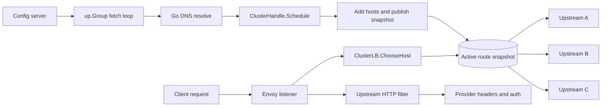

# Cluster Router Example

This example shows how to use Envoy's cluster-provided load balancing path from
Go.

The example is intentionally named `cluster-router` because the important
mechanism is the Cluster Extension. The scenario uses LLM/MCP-style model
routing because it makes the problem concrete.

## Problem This Solves

Request-aware upstream selection often ends up using one of these patterns:

- synthetic headers that Envoy or a custom load balancer parses again
- route re-selection after changing route-sensitive headers
- one static or CDS-managed cluster per destination

For dynamic LLM or MCP routing, one cluster per destination scales poorly. Envoy
dynamic modules provide two relevant extension points, and Transit exposes both:

- **LB Policy**: Envoy owns the cluster and host set. Go only chooses an index.
- **Cluster Extension**: Go owns host discovery and health, then chooses hosts.

This example uses the Cluster Extension path. The module owns the model-to-host
mapping, discovers hosts from config, and selects a host directly from Go.

## What The Example Proves

The current example proves these behaviors with unit and e2e tests:

- A single Envoy route can serve multiple logical model destinations.
- A single dynamic module cluster can contain hosts discovered by Go.
- `ClusterLB.ChooseHost` can choose different hosts based on request context.
- A background `up.Group` can fetch config and update the cluster through
  `ClusterHandle.Schedule`.
- An upstream HTTP filter can inject provider-specific headers after selection.
- The active config can be dumped without leaking configured auth headers.

The e2e test bootstraps two models:

- `gpt-fast` goes to upstream A.
- `claude-safe` goes to upstream B.

Then the config server publishes an additive update:

- `gpt-slow` also goes to upstream A, but uses different auth.
- `kimi-fast` goes to a brand new upstream C.

That gives us three real upstream hosts and proves that model selection is not
one Envoy route or one Envoy cluster per destination.

## High-Level Flow

1. Envoy passes initial model routing config to the Cluster Extension.
2. The Cluster Extension resolves configured targets with Go DNS.
3. The Cluster Extension adds the initial hosts and marks them healthy.
4. The request sends `x-model: gpt-fast`.
5. `ClusterLB.ChooseHost` reads `x-model` and returns the matching host.
6. Envoy selects that upstream host.
7. An upstream HTTP filter injects provider headers before the upstream request
   is sent.

The upstream HTTP filter is not responsible for selecting the host. Upstream
filters run after host selection, so they are only for final request shaping.



## Example Config

The control-plane config can stay small:

```json
{
  "version": "v1",
  "models": {
    "gpt-fast": {
      "target": "localhost:18081",
      "provider": "openai",
      "auth_header": "Bearer openai-token"
    },
    "gpt-slow": {
      "target": "localhost:18081",
      "provider": "openai",
      "auth_header": "Bearer slow-token"
    },
    "claude-safe": {
      "target": "localhost:18082",
      "provider": "anthropic",
      "auth_header": "Bearer anthropic-token"
    },
    "kimi-fast": {
      "target": "localhost:18083",
      "provider": "moonshot",
      "auth_header": "Bearer moonshot-token"
    }
  }
}
```

The cluster config should include:

```json
{
  "config_url": "http://127.0.0.1:18080/routes.json",
  "refresh_millis": 200,
  "timeout_millis": 500,
  "initial": {
    "version": "bootstrap",
    "models": {
      "gpt-fast": {
        "target": "localhost:18081",
        "provider": "openai",
        "auth_header": "Bearer openai-token"
      }
    }
  }
}
```

Initial config makes Envoy startup deterministic. The `config_url` and refresh
settings then let the e2e add `gpt-slow` and `kimi-fast` without changing Envoy
routes or clusters.

## Runtime State

The example needs one shared state object used by both the Cluster Extension and
the upstream HTTP filter. It should make request-path reads cheap and keep
background config fetching out of request callbacks.

The implementation includes an `up.Group`-backed fetch loop for the planned
refresh path:

- the group starts in `Cluster.ServerInitialized`
- the group owns the config fetch loop
- the group stops in `Cluster.Shutdown` and `Cluster.Close`
- no unowned goroutines should be left running after Envoy unloads the module

Use a snapshot store for request-path routing data. Prefer `atomic.Value` for
the full route snapshot because each config refresh replaces the whole map.
Use `sync.Map` or a small mutex-protected map only for mutable host bookkeeping,
such as remembering which Envoy host addresses have already been added.

The request path should read from an immutable snapshot:

```go
type routeSnapshot struct {
	Version string
	Models  map[string]modelRoute
}

type modelRoute struct {
	Target     string
	Address    string
	Provider   string
	AuthHeader string
	BYOK       bool
}
```

Expected store behavior:

- Reads are cheap and safe from request callbacks.
- `ClusterLB.ChooseHost` and the upstream HTTP filter read the same snapshot.
- A config update resolves all targets before publishing a new snapshot.
- Partial or invalid config does not replace the current snapshot.
- Host mutations happen on Envoy's cluster main thread.
- The snapshot must not contain maps that are later mutated in place.

The store can look roughly like this:

```go
type routeStore struct {
	current atomic.Value // stores routeSnapshot
	hostsMu sync.Mutex
	hosts   map[string]up.HostPtr // keyed by resolved address
}
```

If `sync.Map` is used instead of `hostsMu`, keep it scoped to host bookkeeping.
Do not use `sync.Map` as a substitute for publishing a coherent route snapshot.

## Registered Components

The shared library should register both components:

```go
up.RegisterCluster("cluster-router", &clusterFactory{})
up.Register("cluster-router-upstream", upstreamHeaderFilter)
```

The shared library entrypoint should live at:

```text
examples/cluster-router/cmd/main.go
```

and blank-import `github.com/dio/transit/down/abi_impl` there, not in library
packages.

## Cluster Extension Behavior

The Cluster Extension should:

1. Parse cluster config in `Create`.
2. Build the cluster instance in `NewCluster`.
3. Resolve initial routes in `Init`.
4. Add initial hosts with `ClusterHandle.AddHosts`.
5. Mark hosts healthy.
6. Call `ClusterHandle.PreInitComplete`.
7. Start the config fetch `up.Group` in `ServerInitialized`.
8. Stop the group from `Shutdown` and `Close`.

`ChooseHost` should:

1. Read `x-model`.
2. Look up the model route in the latest snapshot.
3. Return `ClusterLBHandle.FindHostByAddress(route.Address)`.
4. Return no host for an unknown model.

## Background Config Fetch

Use `up.Group` for the fetch loop so the background worker has the same
lifecycle as the loaded dynamic module config.

The loop should:

- fetch `config_url`
- parse JSON
- resolve every target with Go DNS
- schedule host mutations with `ClusterHandle.Schedule`
- publish a new snapshot only after successful host application

Sketch:

```go
group := up.NewGroup()
group.AddGoroutine(func(ctx context.Context) {
	ticker := time.NewTicker(refresh)
	defer ticker.Stop()
	for {
		select {
		case <-ctx.Done():
			return
		case <-ticker.C:
			resolved, err := fetchAndResolve(ctx)
			if err != nil {
				continue
			}
			handle.Schedule(func() {
				applyHostsAndPublish(resolved)
			})
		}
	}
})
```

Main-thread rule:

- `AddHosts`, `RemoveHosts`, `UpdateHostHealth`, and `PreInitComplete` must run
  on Envoy's cluster main thread.
- Background goroutines must use `ClusterHandle.Schedule` before mutating hosts.

## Upstream HTTP Filter

The upstream filter should read the same model signal:

```http
x-model: gpt-fast
```

Then inject provider-specific headers from the latest snapshot:

```http
authorization: Bearer openai-token
x-llm-provider: openai
x-cluster-router-version: v1
```

It should leave unknown models unchanged or add a diagnostic header. The e2e
test can decide which behavior is more useful.

## BYOK Follow-Up Scenario

The example can later demonstrate BYOK without changing host selection.

In that scenario the model route still decides the upstream host:

```json
{
  "models": {
    "gpt-fast": {
      "target": "localhost:18081",
      "provider": "openai",
      "byok": 1
    }
  },
  "byok": {
    "tenant-a": {
      "openai": "Bearer tenant-a-openai-key"
    }
  }
}
```

Request:

```http
x-model: gpt-fast
x-tenant: tenant-a
```

Expected behavior:

- `ClusterLB.ChooseHost` uses `x-model` and still selects upstream A.
- The upstream HTTP filter sees `byok: 1`.
- The filter reads `x-tenant`.
- The filter chooses the provider key from BYOK config.
- The upstream request gets `authorization: Bearer tenant-a-openai-key`.

This keeps routing and credential selection separate:

- model route decides where to send traffic
- BYOK config decides which key to inject

## Active Config Dump

The example should expose a debug endpoint that returns the currently active
in-memory route snapshot:

```http
GET /__cluster-router/config
```

Register a downstream HTTP filter for this endpoint:

```go
up.Register("cluster-router-debug", debugHandler)
```

The debug filter should run before `envoy.filters.http.router`. It only handles
the namespaced debug path; all other requests continue through Envoy normally.

The endpoint should marshal a sanitized DTO built from the active snapshot. It
must not return raw static or BYOK tokens.

Example response:

```json
{
  "version": "v2",
  "models": {
    "gpt-fast": {
      "target": "localhost:18081",
      "address": "127.0.0.1:18081",
      "provider": "openai",
      "auth_ref": "openai-default"
    },
    "kimi-fast": {
      "target": "localhost:18083",
      "address": "127.0.0.1:18083",
      "provider": "moonshot",
      "auth_ref": "moonshot-default"
    }
  },
  "auth": {
    "openai-default": {
      "type": "static",
      "configured": true
    },
    "tenant-key": {
      "type": "byok",
      "configured": true
    }
  }
}
```

Implementation sketch:

```go
func debugHandler(w *up.Writer, r *up.Request) {
	if r.Path != "/__cluster-router/config" {
		return
	}
	body, err := json.MarshalIndent(activeRoutes.DebugSnapshot(), "", "  ")
	if err != nil {
		w.SendLocalResponse(500, []byte(`{"error":"marshal config"}`),
			[2]string{"content-type", "application/json"})
		return
	}
	w.SendLocalResponse(200, body, [2]string{"content-type", "application/json"})
}
```

The e2e asserts:

- dump includes `gpt-fast`, `gpt-slow`, `claude-safe`, and `kimi-fast`
- dump includes resolved addresses
- dump redacts auth material

## Envoy Shape

The listener should have one route to one cluster:

```yaml
route:
  cluster: cluster-router
```

The cluster should use Cluster Extension:

```yaml
lb_policy: CLUSTER_PROVIDED
cluster_type:
  name: envoy.clusters.dynamic_modules
  typed_config:
    "@type": type.googleapis.com/envoy.extensions.clusters.dynamic_modules.v3.ClusterConfig
    dynamic_module_config:
      name: cluster-router
    cluster_name: cluster-router
    cluster_config:
      "@type": type.googleapis.com/google.protobuf.StringValue
      value: '{"config_url":"http://127.0.0.1:18080/routes.json","refresh_millis":200,"timeout_millis":500}'
```

The upstream HTTP filter should be configured on the same cluster through
Envoy HTTP protocol options, following the existing root e2e upstream-filter
pattern.

## Files

```text
examples/cluster-router/
  Makefile
  README.md
  router.go
  cluster.go
  upstream_filter.go
  router_test.go
  cmd/main.go
  envoy.yaml
  e2e/
    e2e_test.go
    testdata/envoy.tmpl.yaml
```

## Unit Tests

Unit tests cover:

- config parsing
- default refresh and timeout values
- invalid JSON rejection
- model lookup
- snapshot replacement
- failed config does not replace the current snapshot
- Go DNS target resolution
- upstream header injection
- unknown model behavior

## E2E

The e2e harness should start:

- a config server
- upstream A
- upstream B
- upstream C
- Envoy

Initial routing:

- `gpt-fast` goes to upstream A with provider `openai`
- `claude-safe` goes to upstream B with provider `anthropic`

After refresh:

- `gpt-slow` goes to upstream A with provider `openai`
- `kimi-fast` goes to upstream C with provider `moonshot`

Assertions:

1. `x-model: gpt-fast` reaches upstream A.
2. Upstream A receives `authorization: Bearer openai-token`.
3. Upstream A receives `x-llm-provider: openai`.
4. `x-model: claude-safe` reaches upstream B.
5. Upstream B receives `authorization: Bearer anthropic-token`.
6. Unknown model returns a non-200 response.
7. Updating config adds `gpt-slow` pointing at upstream A.
8. Updating config adds `kimi-fast` pointing at brand new upstream C.
9. A bounded wait observes `x-model: gpt-slow` reaching upstream A after refresh.
10. A bounded wait observes `x-model: kimi-fast` reaching upstream C after refresh.
11. Upstream C receives `authorization: Bearer moonshot-token`.
12. Upstream C receives `x-llm-provider: moonshot`.
13. The debug dump includes all configured models and no bearer tokens.

## Makefile Contract

The example should own its lifecycle:

```sh
make -C examples/cluster-router build
make -C examples/cluster-router test
make -C examples/cluster-router e2e
make -C examples/cluster-router run
make -C examples/cluster-router clean
```

Do not add per-example targets to the root `Makefile`.

## CI

After implementation, update CI to include:

```sh
make -C examples/cluster-router test
make -C examples/cluster-router e2e
```

## Validation

Before committing the implementation:

```sh
make -C examples/cluster-router test
make -C examples/cluster-router e2e
cd examples && GOWORK=off go test ./...
make test
make lint
```

Run nearby e2e targets when changing shared patterns:

```sh
make -C examples/cluster-dfp e2e
make e2e
```

## Open Decisions

- Unknown model behavior: return no host and let Envoy produce 503, or inject a
  local response from a downstream filter before routing.
- Host removal: keep stale hosts for simplicity, or remove hosts no longer
  referenced by config.
- Auth handling: use literal demo tokens in config, or use provider names only
  and synthesize demo tokens in the filter.
- Config bootstrap: the current example requires initial config. Starting empty
  and becoming ready after the first fetch is a possible follow-up.
- Update shape: the e2e covers additive updates first. Route changes and host
  removal are still follow-ups.
- BYOK timing: keep BYOK as a later follow-up once basic model routing and
  provider header injection are stable.
