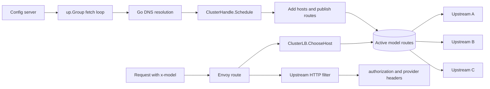

# Cluster Router E2E

This suite runs the `cluster-router` example against a real Envoy process. It
proves the example as a user would run it: Transit builds a dynamic module,
Envoy loads it, requests pass through one route and one cluster, and Go chooses
the upstream host from the request model.

## Scenario

The test starts five local processes in one Go test:

- Envoy, using `testdata/envoy.tmpl.yaml`.
- A tiny config server that serves model routing JSON.
- Upstream A, which returns `upstream a`.
- Upstream B, which returns `upstream b`.
- Upstream C, which returns `upstream c`.

Envoy has one listener and one route. Every request routes to the same
Cluster Extension cluster:

```yaml
route: { cluster: cluster-router }
```

The Cluster Extension owns host discovery and selection. The upstream HTTP
filter runs after host selection and injects provider headers and auth.



## Bootstrap Config

The initial config has two models:

| Model | Target | Provider | Auth |
| --- | --- | --- | --- |
| `gpt-fast` | upstream A | `openai` | `Bearer openai-token` |
| `claude-safe` | upstream B | `anthropic` | `Bearer anthropic-token` |

The test sends requests with `x-model` and asserts:

- `gpt-fast` reaches upstream A.
- `claude-safe` reaches upstream B.
- The upstream request contains `authorization`.
- The upstream request contains `x-llm-provider`.
- The upstream request contains `x-cluster-router-version: initial`.

## Active Config Dump

The suite calls:

```http
GET /__cluster-router/config
```

It asserts the dump contains the active model names and version, but does not
contain bearer tokens. This endpoint is for operator visibility, not secret
inspection.

## Unknown Model

The suite sends a request with:

```http
x-model: unknown-model
```

It asserts the response is not `200 OK`. The Cluster Extension returns no host
for unknown models, so Envoy handles the failure.

## Refresh Config

After Envoy is ready, the config server publishes a new version named
`updated`. The refresh adds two models:

| Model | Target | Provider | Auth |
| --- | --- | --- | --- |
| `gpt-slow` | upstream A | `openai` | `Bearer slow-token` |
| `kimi-fast` | upstream C | `moonshot` | `Bearer moonshot-token` |

The first addition proves a config update can add a model that reuses an
existing host. The second addition proves a config update can introduce a brand
new host that Envoy did not know at bootstrap.

The test waits until:

- `gpt-slow` reaches upstream A with `x-cluster-router-version: updated`.
- `kimi-fast` reaches upstream C with `x-cluster-router-version: updated`.
- upstream C receives `x-llm-provider: moonshot`.
- the active config dump includes `gpt-slow`, `kimi-fast`, and `updated`.
- the active config dump still redacts bearer tokens.

## Why This Matters

This is the behavior cluster-router exists to demonstrate: request-aware
upstream selection without one Envoy route or one Envoy cluster per destination.
The Go module owns model discovery, host addition, and host selection, while
Envoy still owns the HTTP proxying path.

## Run It

From the repository root:

```sh
make -C examples/cluster-router e2e
```

The Makefile uses `-count=1` so Envoy starts on every run instead of reusing a
cached Go test result.
