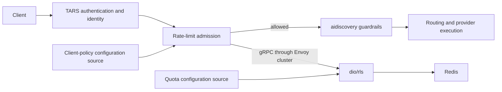

# Fraser adoption decision

Use a separate admission filter after TARS identity resolution and before
`aidiscovery`. Keep the native RLS path available. Prefer the module when Fraser
needs independently delivered descriptor policy or application-specific
admission decisions; a custom quota-rule source alone does not require it.



`L` is either the native Envoy filter or this dynamic module. A local caller
quota denial returns 429 before guardrail work. A provider-attempt quota check
would instead belong inside routing execution and may advance a chain. These
are different contracts; this example implements only the first.

## Evidence and branch boundaries

Inspected Fraser `origin/adopt-orange` at `c6f1edc98` and the separate current
`tars-dataplane` implementation on main at `a32c4d172`:

- Main `tars-dataplane/filter.go`, `OnRequestHeaders`: authentication and
  project/gateway authorization precede stamping `x-tars-id`, `x-tars-user`,
  `x-tars-customer`, `x-tars-workspace`, and project/gateway selectors. Client
  guardrail selectors are removed before trusted values are installed.
- Main `svc/internal/liaison/handlers/routetypeguardrails/handler.go` inserts
  the `aidiscovery` filter through an EnvoyPatchPolicy. TARS and guardrails
  currently share `libcomposer.so`, with distinct filter names.
- `adopt-orange` `svc/test/e2e/mod/tars/local/tars_local_test.go`,
  `injectLocalRLS`: tests inject the native Envoy RLS filter, using `orange`
  domain and `[key_id=<x-tars-id>, dim=rpm]`. This is test wiring, not a Plum
  implementation or proof of production activation.
- Both inspected Fraser branches have
  `svc/internal/liaison/resources/eg/backendtrafficpolicy.go`,
  `buildRateLimitSpec`: selectors use `x-tars-id`; token limits charge response
  metadata such as `io.envoy.ai_gateway.llm_input_token`.

## Why choose the module for TARS

The strongest reason is **code-owned descriptor assembly**, not simply access
to metadata. Main TARS already emits `tars.api_key_id`, `user_id`, `customer_id`,
`workspace_id`, `project_id` (when resolved), and `router_id`. A Fraser adapter
can consume these in `Config.BuildDescriptors`, select the applicable scopes
and validate prerequisites. The generic module still owns the RLS callout and
admission decision. Share Envoy metadata/string filter state across separately
loaded modules, not pointers into a package-local Go object registry.

Native Envoy also supports metadata descriptor actions. For a fixed mapping,
this is simple and does not need a new xDS server or per-tenant xDS updates:

```yaml
rate_limits:
  - actions:
      - metadata:
          descriptor_key: key_id
          metadata_key:
            key: tars
            path: [{key: router_id}]
          source: DYNAMIC
      - generic_key:
          descriptor_key: dim
          descriptor_value: rpm
```

Configure the native filter and these route actions once. Metadata values vary
per request. RLS quota values reload through the service's loader independently.
Changing the mapping/filter/cluster live needs Envoy configuration delivery
(typically Envoy Gateway/Liaison's existing xDS path); static bootstrap works
without xDS but requires reloading/restarting Envoy for those changes. Native
missing-metadata behavior can skip a descriptor, so enforce required identity
upstream. The module explicitly rejects missing descriptor input.

Recommendation: start with native for stable mappings. Choose the module when
Fraser-owned conditional logic, custom validation, or a separately refreshed
descriptor-policy source earns the additional code and deployment surface.

| Concern | Benefit of an independent module | Qualification |
|---|---|---|
| Identity-to-descriptor mapping | Consume TARS-authenticated headers or string filter state through an explicit interface; no duplicate authentication | Native request-header actions can already consume trusted headers |
| Descriptor-policy updates | Publish one validated immutable snapshot without regenerating every route policy | RLS quota rules already reload independently with either client |
| Reuse across dataplanes | The same small admission component can sit behind current TARS or a Plum-based pipeline | Each host still needs to supply the agreed trusted identity fields |
| Failure and decision behavior | Version/test missing-identity, unavailable-service and future decision behavior as a small component | We now own correctness, latency, observability and compatibility work that native Envoy provides |
| Release ownership | Separate source/package and potentially artifact release from TARS and guardrails | Envoy ABI and shared-library coexistence must be proven against the target image |

The practical simplification is:

```text
current route-coupled policy:
  Valet/config → Worker/CRDs → Liaison BackendTrafficPolicies → Envoy config

proposed module client policy:
  source adapter → validate → immutable snapshot → request descriptors

service quota policy, common to both clients:
  dio/rls provider.Loader → validated rule snapshot → Redis-backed enforcement
```

That does not remove Envoy configuration: filter insertion, the RLS cluster,
HTTP/2, TLS and upstream authentication remain Envoy-owned. It also does not
make module and RLS policy publication atomic. Agree descriptor schema/version
and roll out compatible RLS rules before enabling new descriptor shapes;
unmatched descriptors may be treated as unlimited by the service.

## Ordering and preserved invariants

1. Authenticate and authorize first; never use caller-supplied tenancy as quota
   identity. Stamp or expose trusted descriptors before this filter runs.
2. Check caller admission before `aidiscovery` to avoid paying for guardrail
   calls on denied requests. Both native and module paths can do this.
3. For model-specific policy, confirm the model has been resolved before the
   check. A JSON-body model is not inherently available in the headers phase;
   this example intentionally does not add an AI-body parser.
4. Count one admission check per incoming request. Do not retry incrementing
   RLS calls automatically or charge the same request through both native and
   module filters.
5. Guardrail rejection still consumes an admitted request unit. Token/cost
   accounting requires a separate response/usage contract.
6. Keep quota checks on an Envoy-managed cluster, with a bounded deadline and
   explicit open/closed service-error policy.

## What must precede a Fraser rollout

- Preserve existing token-budget semantics. This module sends `hits_addend=1`
  and has no response token accounting, so it is not a replacement for the
  existing token-cost BackendTrafficPolicies.
- Add explicit filter-order tests and verify generated Envoy configuration:
  TARS identity → admission → aidiscovery → provider routing. Existing patch
  priorities/index-zero insertions must not accidentally invert that order.
- Build/load alongside Composer with the actual Envoy and SDK pins. This is an
  Envoy `c-shared` dynamic module, not a Go `plugin` for Composer's plugin loader.
  Do not pass `libratelimit.so` to a loader expecting Go factory exports.
- Verify bypass paths deliberately: health/model-discovery endpoints, MCP,
  WebSocket upgrades and any alternate listeners. Do not require nonexistent
  identity indiscriminately, or introduce a broad skip that bypasses admission.
- Test 429/error response formatting and TARS identity/correlation headers.
  This example returns plain text and does not yet propagate RLS headers.
- Qualify `dio/rls` separately: its current local source compiles but has no
  tests; Redis-error handling and provider refresh behavior need their own
  correctness/availability review. Protocol compatibility is not readiness.

No Fraser integration or production deployment is part of this example.
