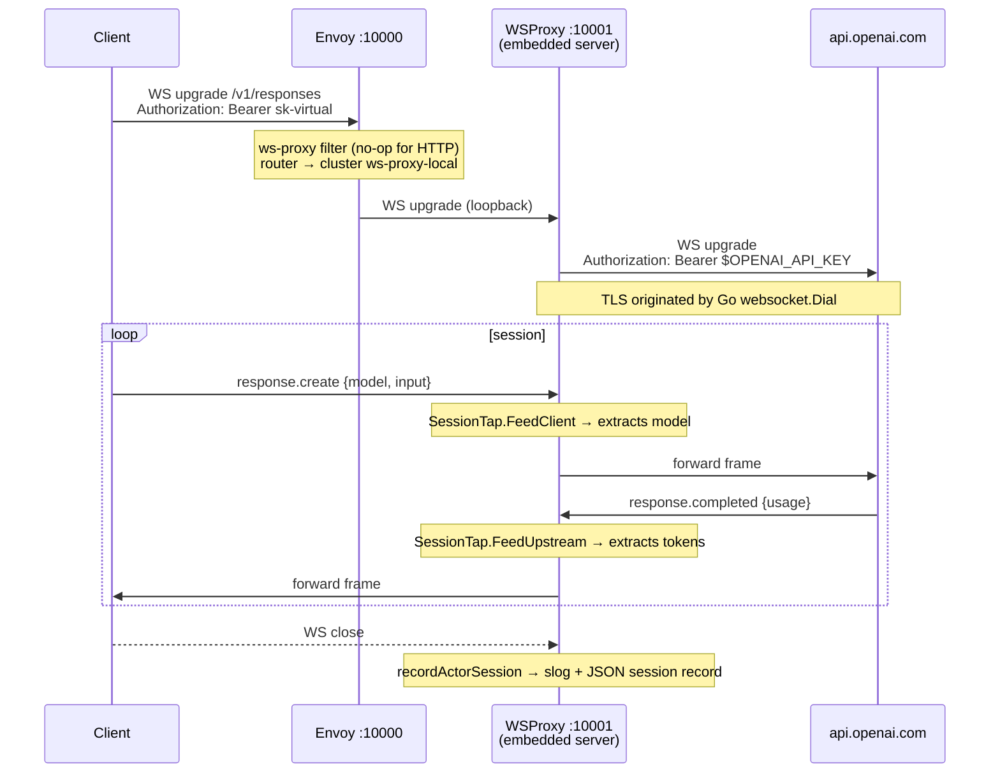
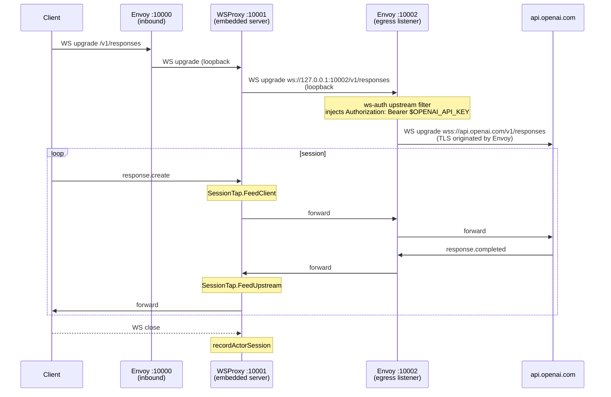

# ws-proxy

Proxies WebSocket connections to the OpenAI Responses API
(`wss://api.openai.com/v1/responses`), injecting provider credentials at
upstream dial time and tapping token usage from `response.completed` frames for
billing.

Demonstrates `up.RegisterWithGroup` — an embedded `net/http` server running as
a background goroutine inside an Envoy dynamic module.

Reference: https://openai.com/index/speeding-up-agentic-workflows-with-websockets/

---

## What problem this solves

`POST /v1/responses` pays a full HTTP round-trip per turn. For agentic workflows
with many sequential tool calls this compounds. OpenAI's WebSocket mode
eliminates that:

- One persistent WS connection handles multiple sequential `response.create`
  requests without reconnecting.
- The server maintains a connection-local in-memory cache of the most recent
  response. Continuation only needs `previous_response_id` + new input items —
  not the full history. Compatible with `store: false` and Zero Data Retention.
- Result: ~40% latency reduction for workflows with 20+ tool calls.

The proxy sits between the client and OpenAI, injecting the resolved credential
at upstream dial time and extracting token usage for billing.

This is **not** the Realtime API (`/v1/realtime`). No audio, no VAD, no voice.
This is the standard text/tool Responses API over WebSocket transport.

---

## Architecture

### Direct-dial (default)

The embedded server dials the upstream provider directly. Auth header injected
in Go before `websocket.Dial`.



### Egress-via-Envoy (`WSPROXY_EGRESS_URL` set)

The embedded server dials a local Envoy egress listener instead of the upstream
directly. Envoy handles TLS origination and credential injection via the
`ws-auth` upstream filter. This keeps auth and TLS management in Envoy,
consistent with how the `upstream` cluster handles non-WS traffic.



The two loopback connections are established **once per session**, not per
frame. Per-frame overhead is two extra kernel copies (~microseconds) — negligible
against OpenAI network RTT of 50–150 ms.

### Why the loopback hop exists

After `101 Switching Protocols`, Envoy handles WS frame forwarding as a
transparent TCP tunnel. The dynamic module ABI has no per-frame callback. The
embedded server is the only way to intercept frames from a dynamic module
without modifying Envoy.

---

## Protocol

### Connection

```
wss://api.openai.com/v1/responses
Authorization: Bearer {OPENAI_API_KEY}
```

Standard WebSocket upgrade. Auth is in the HTTP header at upgrade time. All
subsequent frames on the connection inherit that auth. No model in the URL.

### Client → server

```json
{
  "type": "response.create",
  "model": "gpt-4.1",
  "store": false,
  "previous_response_id": "resp_abc123",
  "input": [
    {"type": "message", "role": "user",
     "content": [{"type": "input_text", "text": "next step"}]}
  ]
}
```

`previous_response_id` omitted on the first request. Subsequent requests within
the same session reference the immediately preceding response — full history is
not resent.

### Server → client

| Event | Notes |
|---|---|
| `response.created` | response started |
| `response.output_item.added` | output item started |
| `response.output_item.delta` | streaming content chunk |
| `response.output_item.done` | output item complete |
| `response.completed` | **tap target** — contains usage |
| `response.failed` | response errored |
| `error` | connection-level error (does not close WS) |

Usage is in `response.completed`:

```json
{
  "type": "response.completed",
  "response": {
    "id": "resp_abc123",
    "usage": {"input_tokens": 210, "output_tokens": 48, "total_tokens": 258}
  }
}
```

### Session semantics

- One in-flight `response.create` per connection (sequential, not multiplexed).
  For parallel requests use separate WS connections.
- Server enforces a 60-minute connection limit, then sends:
  ```json
  {"type":"error","error":{"code":"websocket_connection_limit_reached"}}
  ```
  Client must reconnect and continue with `previous_response_id`.

---

## Frame tapping

`SessionTap` intercepts two frame types:

- **`response.create`** (client → upstream): extracts `model` field.
- **`response.completed`** (upstream → client): extracts `input_tokens` and
  `output_tokens`.

Fast-path: `bytes.Contains(frame, []byte("response.completed"))` before any
`json.Unmarshal`. The majority of frames (`response.output_item.delta`, etc.)
never reach the JSON decoder.

Both taps run in the pump goroutines and must be non-blocking.

---

## Configuration

All options are read from environment variables at startup (env overrides `WSPROXY_*`):

| Env var | Default | Notes |
|---|---|---|
| `WSPROXY_LISTEN_ADDR` | `127.0.0.1:10001` | Embedded server listen address; must match `ws-proxy-local` cluster |
| `WSPROXY_UPSTREAM_URL` | `wss://api.openai.com` | Upstream base URL (direct-dial mode) |
| `WSPROXY_AUTH_VALUE` | `Bearer ${OPENAI_API_KEY}` | Auth header value; `${VAR}` expanded |
| `WSPROXY_EGRESS_URL` | `` (empty) | When set, dial this Envoy egress listener instead of upstream directly |
| `WSPROXY_SESSION_LOG` | `` (empty) | Path for JSON-line session records; used by e2e tests |

---

## Session record

At session end, `recordActorSession` emits a structured slog line and, when
`WSPROXY_SESSION_LOG` is set, appends a JSON line to that file:

```json
{"path":"/v1/responses","model":"gpt-4.1","input_tokens":100,"output_tokens":42,"duration_ms":312,"result":"ok","reason":""}
```

The JSON file is the e2e test assertion target — no log parsing needed.

---

## Envoy config

### Inbound listener (`:10000`)

```
upgrade_configs: [{upgrade_type: websocket}]
http_filters:
  - ws-proxy      ← no-op for HTTP; starts embedded server via Group
  - router

routes:
  - match: prefix=/ + Upgrade=websocket → cluster ws-proxy-local (loopback)
  - match: prefix=/                      → cluster mock-upstream (non-WS)
```

### Egress listener (`:10002`, egress-via-Envoy mode)

```
upgrade_configs: [{upgrade_type: websocket}]
http_filters:
  - router

routes:
  - match: prefix=/ + Upgrade=websocket → cluster ws-proxy-egress
      (ws-auth upstream filter injects Bearer token, Envoy dials api.openai.com over TLS)
```

---

## Files

```
examples/ws-proxy/
  README.md               this file
  ws_proxy.go             WSProxy, SessionTap, frame pump, Register()
  auth.go                 ws-auth upstream HTTP filter (credential injection)
  observability.go        SessionRecord, InitSessionLog, recordActorSession
  ws_proxy_test.go        unit tests for SessionTap
  envoy.yaml              reference Envoy config (direct-dial + egress-via-Envoy)
  Makefile
  e2e/
    e2e_test.go           end-to-end tests (mock upstream, no real API key)
    testdata/
      envoy.tmpl.yaml     Envoy config template rendered per test run
```

---

## Running

```sh
# Build
make -C examples/ws-proxy build

# Unit tests (no Envoy)
make -C examples/ws-proxy test

# E2e tests (mock upstream, no API key needed)
make -C examples/ws-proxy e2e

# Run against real OpenAI
OPENAI_API_KEY=sk-... make -C examples/ws-proxy run
# then connect:
wscat -c ws://localhost:10000/v1/responses -H 'Authorization: Bearer sk-test'
```

---

## Out of scope

- Real credential cache / virtual key validation (P2: `CredentialCache.Pin()`)
- `previous_response_id` tracking — proxy forwards `response.create` verbatim
- Reconnect on `websocket_connection_limit_reached` — client responsibility
- OTLP metric export (`ws_proxy_sessions_total`, `ws_proxy_session_duration_ms`) — P3
- Fraser4 integration (`PolicyCache`, `CredentialCache`, Valet DB) — P4
- Envoy Gateway / EPP cluster injection (`integrations/ws-proxy-eg/`) — P1
- Realtime API (`/v1/realtime`) — separate protocol
