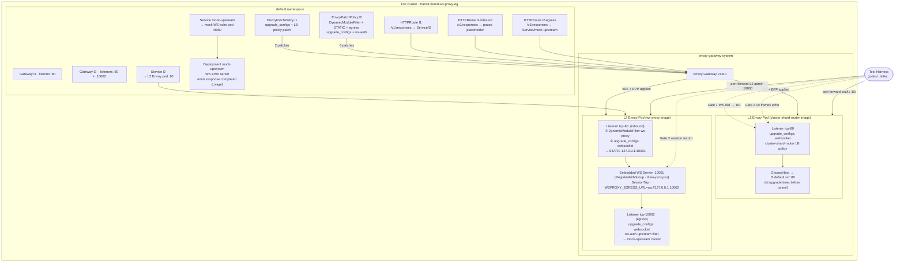
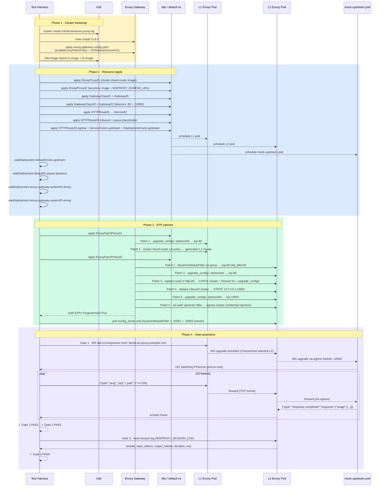

# Tiered WS-Proxy Envoy Gateway Integration

Two-stage WebSocket pipeline under Envoy Gateway: L1 shard-routes the WS
upgrade to the right L2 pod; L2 runs the embedded ws-proxy server and egresses
to a mock upstream via a second Envoy-managed listener.

Both tiers are Envoy Gateway managed — two GatewayClasses, two EnvoyProxy
objects, two generated Envoy Deployments in the same k3d cluster.

The point of the demo is the full ownership chain: **Envoy holds credentials
and TLS at every hop; Go holds session logic at L2**. In the non-WS path this
is free because Cluster Extension clusters give Envoy egress ownership by
default. For WS, after `101 Switching Protocols` Envoy becomes a transparent
TCP tunnel and the Cluster Extension cannot touch frames. The embedded server +
L2 egress listener restores the same property for WebSocket traffic.

## Scenario

Three structural gates:

- **Gate 1**: WS upgrade from client reaches L1, L1 selects L2, upgrade
  propagates to L2 embedded server — `101` at both hops, no `426`.
- **Gate 2**: Frames echo end-to-end intact (client → L1 → L2 embedded server
  → L2 egress listener → mock upstream → back). 10 frames of varying size.
- **Gate 3**: L2 session record written after close — proves `SessionTap` fired
  on real frames, extracting model and token counts from the mock's
  `response.completed`.

## Architecture

### Runtime topology



### Test harness lifecycle



## Components

### L1 Envoy image (`Dockerfile.l1`)

- `/usr/local/bin/envoy`
- `/etc/envoy/dynamic-modules/libcluster-shard-router.so`

The cluster-shard-router module uses `RegisterLBPolicy` (CLUSTER_PROVIDED load
balancing). At WS upgrade time `ChooseHost` selects the L2 pod. After `101`,
L1 is a transparent TCP tunnel — no frames inspected at L1.

### L2 Envoy image (`Dockerfile.l2`)

- `/usr/local/bin/envoy`
- `/etc/envoy/dynamic-modules/libws-proxy.so`

The ws-proxy module uses `RegisterWithGroup`. The embedded server on
`:10001` intercepts WS frames, runs `SessionTap`, and dials
`WSPROXY_EGRESS_URL=ws://127.0.0.1:10002` for each session. The egress
listener on `:10002` is the second Gateway listener, EG-generated and
EPP-patched to add `upgrade_configs: websocket` and the `ws-auth` upstream
filter.

### Mock upstream (`Dockerfile.mock`)

A minimal Go WS echo server built `CGO_ENABLED=0` and deployed as a pod. It:

- accepts any WS upgrade on `/v1/responses`
- echoes every frame back unchanged — except `response.create`, which it
  answers with a synthetic `response.completed` containing fixed `usage` fields
  so Gate 3 can assert exact token counts

### Two-listener L2 Gateway

`Gateway/l2` has two listeners:

```yaml
listeners:
- name: inbound
  port: 80
  protocol: HTTP
- name: egress
  port: 10002
  protocol: HTTP
```

EG generates `tcp-80` (inbound) and `tcp-10002` (egress) from a single
EnvoyProxy/l2 deployment. EPP patches both. This avoids needing EPP to create a
net-new listener resource — EPP can only patch named xDS resources EG has
already generated; it cannot add new top-level resources.

## EPP design

### L1 EPP (2 patches)

| # | Resource | Op | What |
|---|---|---|---|
| 1 | `Listener/tcp-80` | add | `upgrade_configs: websocket` |
| 2 | `Cluster/<httproute-l1/.../rule/0>` | replace | cluster type → CLUSTER_PROVIDED with cluster-shard-router extension |

### L2 EPP (6 patches)

| # | Resource | Op | What |
|---|---|---|---|
| 1 | `Listener/tcp-80` | add | `DynamicModuleFilter ws-proxy` at `http_filters/0` |
| 2 | `Listener/tcp-80` | add | `upgrade_configs: websocket` |
| 3 | `RouteConfig/http-80` | replace | route → STATIC cluster, `timeout: 0s`, `upgrade_configs: websocket` |
| 4 | `Cluster/<httproute-l2-inbound/.../rule/0>` | replace | STATIC `127.0.0.1:10001` |
| 5 | `Listener/tcp-10002` | add | `upgrade_configs: websocket` |
| 6 | `Cluster/<httproute-l2-egress/.../rule/0>` | add | `upstream_http_filters` with `ws-auth` credential filter |

## Why the embedded server exists

After `101 Switching Protocols` Envoy handles WS frame forwarding as a
transparent TCP tunnel. The dynamic module ABI has no per-frame callback. The
embedded server is the only way to intercept frames from a dynamic module
without modifying Envoy.

## Why egress via Envoy at L2

In the non-WS path (cluster-router, cluster-shard-router) egress is via Envoy
for free: the Cluster Extension gives `ChooseHost` to Go but Envoy owns the TCP
connection, TLS origination, and upstream HTTP filters (auth injection). For WS
the tunnel breaks that — Go (the embedded server) owns the upstream dial. The
L2 egress listener restores Envoy ownership: the embedded server dials a plain
loopback connection; Envoy's egress listener handles TLS and credential injection
via `ws-auth` upstream filter. No credentials in Go code; no TLS in Go code.

## Running

```sh
# Full e2e (builds both images, creates cluster, runs gates, deletes cluster)
make -C integrations/tiered-ws-proxy-eg e2e

# Reuse prebuilt images
make -C integrations/tiered-ws-proxy-eg e2e SKIP_IMAGE_BUILD=1 \
  L1_IMAGE=transit-tiered-ws-proxy-l1:<tag> \
  L2_IMAGE=transit-tiered-ws-proxy-l2:<tag> \
  MOCK_IMAGE=transit-tiered-ws-proxy-mock:<tag>

# Install only (keeps cluster for manual inspection)
make -C integrations/tiered-ws-proxy-eg eg-install KEEP_CLUSTER=1

# Publish short-lived ttl.sh images for CI
make -C integrations/tiered-ws-proxy-eg publish
```
