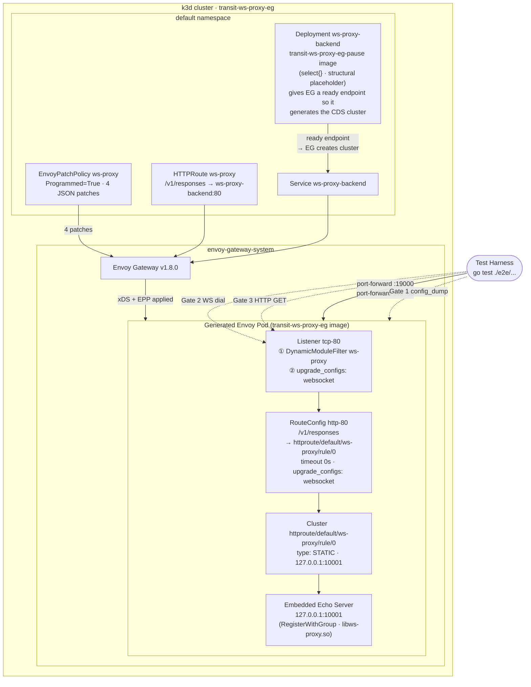
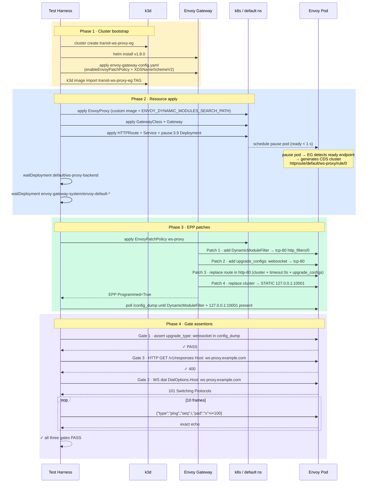

# WS-Proxy Envoy Gateway Integration

This integration runs the `integrations/ws-proxy-eg/echo` dynamic module behind
Envoy Gateway in a local k3d cluster. It is the Kubernetes demo for embedded
WebSocket proxying: Envoy routes WS traffic to a Go echo server that lives
inside the Envoy pod itself, with no external upstream.

The point of the demo is structural: a Transit dynamic module registers an
embedded HTTP/WS server via `RegisterWithGroup`. Gateway API provides the
listener and route shape; EnvoyPatchPolicy rewires the generated xDS so that
all `/v1/responses` traffic is served by the embedded server, not a Kubernetes
workload.

## Scenario

All three gates must pass:

- **Gate 1**: `upgrade_configs: websocket` is injected into the Envoy listener
  via EPP. Without it, Envoy returns 426 Upgrade Required on any WS dial.
- **Gate 2**: WS frames pass through the EPP-replaced STATIC loopback cluster
  intact and in order. The test sends 10 frames of varying sizes and checks the
  echo for each.
- **Gate 3**: A plain HTTP GET to `/v1/responses` returns 400. The embedded
  server calls `websocket.Accept` before doing anything else, so plain HTTP is
  rejected before any handler logic runs.

## Architecture

### Runtime topology



### Test harness lifecycle



## Components

The integration creates:

- Envoy Gateway, installed by Helm.
- `EnvoyProxy`, pointing Envoy Gateway at the custom Envoy image.
- `GatewayClass`, `Gateway`, and `HTTPRoute`.
- `EnvoyPatchPolicy`, with four JSON patches (see `k8s/epp.tmpl.yaml`).
- `Service ws-proxy-backend` and the vendored pause Deployment.

The custom Envoy image (`Dockerfile.envoy`) contains:

- `/usr/local/bin/envoy`
- `/etc/envoy/dynamic-modules/libws-proxy.so` (built from `echo/cmd`)
- Debian bookworm slim as the glibc userspace

The pause image (`Dockerfile.pause`) contains:

- A single static binary built from `pause/main.go`: `func main() { select {} }`
- `FROM scratch` — nothing else in the image

## Why the pause placeholder Deployment

Envoy Gateway v1.8 does not generate a CDS cluster for an HTTPRoute backend
when there are no ready endpoints. An EPP `replace` patch on a non-existent
cluster fails with `ResourceNotFound` and `Programmed=False`.

The `ws-proxy-backend` Deployment runs the vendored pause image
(`transit-ws-proxy-eg-pause`). It is a static binary built from four lines of
Go (`func main() { select {} }`) in a `FROM scratch` image. It starts in under
a second, has no readiness probe (ready immediately), and its only role is to
give EG a ready endpoint so it generates
`httproute/default/ws-proxy/rule/0`. The EPP then replaces the entire cluster
object with a STATIC entry pointing at `127.0.0.1:10001`. No real traffic ever
reaches the pause container.

Vendoring the image rather than pulling `registry.k8s.io/pause:3.9` makes the
intent explicit in the repository: `Dockerfile.pause` and `pause/main.go` are
honest about what the placeholder is and why it exists.

The e2e waits for the placeholder Deployment before applying the EPP to
eliminate the race where EG has not yet created the cluster.

## Why EnvoyPatchPolicy

Envoy Gateway owns the generated xDS. This demo keeps Gateway API as the source
of truth and uses EnvoyPatchPolicy to:

1. Add the `DynamicModuleFilter` to the generated listener, which triggers
   `RegisterWithGroup` and starts the embedded echo server on `127.0.0.1:10001`.
2. Add `upgrade_configs: websocket` to the listener so Envoy accepts WS upgrades.
3. Replace the generated route with one that has `timeout: 0s` and
   `upgrade_configs: websocket`.
4. Replace the generated backend cluster with a STATIC cluster pointing at
   the embedded server.

The important generated names for Envoy Gateway v1.8 with `XDSNameSchemeV2`:

- backend cluster: `httproute/default/ws-proxy/rule/0`
- listener: `tcp-80`
- route configuration: `http-80`

EnvoyPatchPolicy status stores conditions under
`status.ancestors[*].conditions`, so the e2e polls those directly rather than
using `kubectl wait envoypatchpolicy --for=condition=Programmed`.

## Dynamic module loading

The Envoy image carries the `.so` at:

```
/etc/envoy/dynamic-modules/libws-proxy.so
```

`EnvoyProxy` configures:

- the custom Envoy image
- `GODEBUG=cgocheck=0`
- `ENVOY_DYNAMIC_MODULES_SEARCH_PATH=/etc/envoy/dynamic-modules`

The `EnvoyProxy` spec also declares the module under `dynamicModules` so Envoy
Gateway registers it globally before the first listener is created.

## Running

```
# full e2e (builds both images, creates cluster, runs gates, deletes cluster)
make -C integrations/ws-proxy-eg e2e

# reuse prebuilt images
make -C integrations/ws-proxy-eg e2e SKIP_IMAGE_BUILD=1 \
  IMAGE=transit-ws-proxy-eg:<tag> \
  PAUSE_IMAGE=transit-ws-proxy-eg-pause:<tag>

# install only (keeps cluster for manual inspection)
make -C integrations/ws-proxy-eg eg-install KEEP_CLUSTER=1

# publish short-lived ttl.sh images for CI
make -C integrations/ws-proxy-eg publish
# then in CI: K3D_SKIP_IMAGE_IMPORT=1 pulls from registry instead of importing
```
